<h2 align="center">Hi there, I'm fatSheep (00fish0) 👋</h2>

<!-- 

  ML systems • LLM/VLM efficiency • open to collaboration

 -->

---

**About**
- 👋 Hi, I’m fatSheep.
- 🌱 Currently learning programming.
- 👀 Always happy to connect and collaborate.

**Focus**
- ML systems
- LLM/VLM efficiency
- Systems performance and tooling

**Tech Stack**

**Languages**

  

**Systems & ML Infrastructure**

  

---

**GitHub Metrics**

  
  

<!-- ---

  

  

 -->
