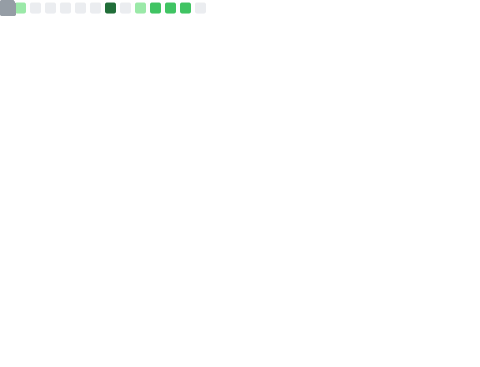
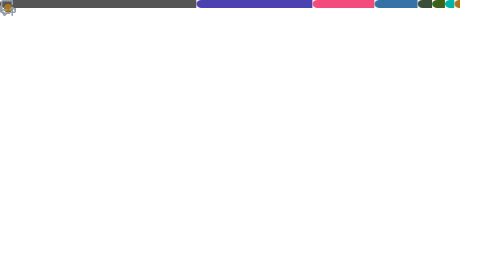

Hi there 👋

My name is Zihan Tang. I am currently an undergraduate (2023-2027) student in Computer Science and Technology at Harbin Institute of Technology, Shenzhen (HITSZ). My research focus is on machine learning systems, with an emphasis on LLM serving infrastructure.

🔭 I'm currently working on the systems substrate for large language model serving. Specifically, my focus includes KV cache transport and storage across GPU memory, RDMA, and distributed store backends, high availability for distributed KV cache services, and TCP/RDMA transport internals. I also contribute upstream and downstream across the vLLM/SGLang ecosystem and work on AI infrastructure deployment and tuning. Additionally, I'm exploring on-device inference acceleration.

📫 How to reach me:

🤔 I'm also passionate about open-source community building and LLM serving systems. Welcome experts from both academia and industry to connect with me.

✨ Feel free to reach out via email for any related questions.

---

  
  

